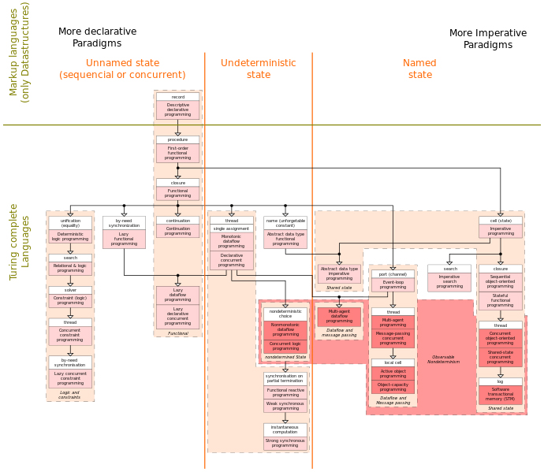

Programming paradigms are a way to classify programming languages based on their features. Languages can be classified into multiple paradigms.

# Overview

Overview of the various programming paradigms according to Peter Van Roy.

Just as software engineering (as a process) is defined by differing methodologies, so the programming languages (as models of computation) are defined by differing paradigms. Some languages are designed to support one paradigm (Smalltalk supports object-oriented programming, Haskell supports functional programming), while other programming languages support multiple paradigms (such as Object Pascal, C++, Java, JavaScript, C#, Scala, Visual Basic, Common Lisp, Scheme, Perl, PHP, Python, Ruby, Wolfram Language, Oz, and F#). For example, programs written in C++, Object Pascal or PHP can be purely procedural, purely object-oriented, or can contain elements of both or other paradigms. Software designers and programmers decide how to use those paradigm elements.

In object-oriented programming, programs are treated as a set of interacting objects. In functional programming, programs are treated as a sequence of stateless function evaluations. When programming computers or systems with many processors, in process-oriented programming, programs are treated as sets of concurrent processes that act on a logical shared data structures.

Many programming paradigms are as well known for the techniques they forbid as for those they enable. For instance, pure functional programming disallows use of side-effects, while structured programming disallows use of the goto statement. Partly for this reason, new paradigms are often regarded as doctrinaire or overly rigid by those accustomed to earlier styles. Yet, avoiding certain techniques can make it easier to understand program behavior, and to prove theorems about program correctness.

Programming paradigms can also be compared with programming models which allow invoking an execution model by using only an API. Programming models can also be classified into paradigms, based on features of the execution model.

For parallel computing, using a programming model instead of a language is common. The reason is that details of the parallel hardware leak into the abstractions used to program the hardware. This causes the programmer to have to map patterns in the algorithm onto patterns in the execution model (which have been inserted due to leakage of hardware into the abstraction). As a consequence, no one parallel programming language maps well to all computation problems. It is thus more convenient to use a base sequential language and insert API calls to parallel execution models, via a programming model. Such parallel programming models can be classified according to abstractions that reflect the hardware, such as shared memory, distributed memory with message passing, notions of place visible in the code, and so forth. These can be considered flavors of programming paradigm that apply to only parallel languages and programming models.

# Programming paradigms
<!--ts-->
   * [Action](action-language.md)
   * [Agent-oriented](agent-oriented.md)
   * [Array-oriented](array-oriented.md)
   * [Automata-based](automata-based.md)
   * [Concurrent computing](concurrent-computing/concurrent-computing.md)
     * [Relativistic programming](concurrent-computing/relativistic-programming.md)
   * [Data-driven](data-driven.md)
   * [Declarative (contrast: Imperative)](declarative/declerative.md)
     * [Functional](#functional)
       * [Functional logic](#functional-logic)
       * [Purely functional](#purely-functional)
     * [Logic](#logic)
         * [Abductive logic](#abductive-logic)
         * [Answer set](#answer-set)
         * [Concurrent logic](#concurrent-logic)
         * [Functional Logic](#functional-logic)
         * [Inductive logic](#inductive-logic)
     * [Constraint](#constraint)
         * [Constraint logic](#constraint-logic)
           * [Concurrent constraint logic](#concurrent-constraint-logic)
     * [Dataflow](#dataflow)
       * [Flow based](#flow-based)
       * [Reactive](#reactive)
     * [Ontology](#ontology)
   * [Differentiable](#differentiable)
   * [Dynamic/scripting](#dynamic-scripting)
   * [Event-driven](#event-driven)
   * [Function-level (contrast: Value-level)](#function-level)
     * [Point-free style](#point-free-style)
       * [Concatenative](#concatenative)
   * [Generic](#generic)
   * [Imperative (contrast: Declarative)](#imperative)
     * [Procedural](#procedural)
     * [Object-oriented](#object-oriented)
       * [Polymorphic](#polymorphic)
   * [Intentional](#intentional)
   * [Language-oriented](#language-oriented)
     * [Domain-specific](#domain-specific)
   * [Literate](#literate)
   * [Natural-language programming](#natural-language-programming)
   * [Metaprogramming](#metaprogramming)
     * [Automatic](#domain-specific)
       * [Inductive programming](#inductive-programming)
     * [Reflective](#domain-specific)
       * [Attribute-oriented](#attribute-oriented)
     * [Macro](#macro)
     * [Template](#template)
   * [Non-structured (contrast: Structured)](#non-structured)
     * [Array](#array)
   * [Nondeterministic](#Nondeterministic)
     * [Process-oriented](#process-oriented)
   * [Probabilistic](#probilistic)
   * [Quantum](#quantum)
   * [Set-theoretic](#set-theoretic)
   * [Stack-based](#stack-based)
   * [Structured (contrast: Non-structured)](#structured)
     * [Block-oriented](#block-oriented)
       * [Structured concurrency](#structured-concurrency)
     * [Object-oriented](#object-oriented)
       * [Actor-based](#actor-based)
       * [Class-based](#class-based)
       * [Concurrent](#concurrent)
       * [Prototype-based](#prototype-based)
       * [By separation of concerns](#by-separation-of-concerns)
         * [Aspect-oriented](#process-oriented)
         * [Role-oriented](#process-oriented)
         * [Subject-oriented](#process-oriented)
     * [Recursive](#recursive)
   * [Symbolic](#symbolic)
   * [Value-level (contrast: Function-level)](#value-level)
<!--te-->

# Contribution guidelines
- TBA

# References
- TBA 
