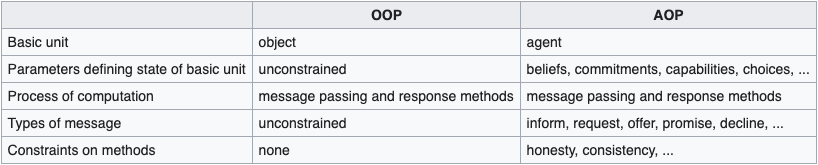

Agent Oriented
============
Agent-oriented programming (AOP) is a programming paradigm where the construction of the software is centered on the concept of software agents. In contrast to object-oriented programming which has objects (providing methods with variable parameters) at its core, AOP has externally specified agents (with interfaces and messaging capabilities) at its core. They can be thought of as abstractions of objects. Exchanged messages are interpreted by receiving "agents", in a way specific to its class of agents.

Historically, the concept of agent-oriented programming and the idea of centering software around the concept of an Agent was introduced by Yoav Shoham within his Artificial Intelligence studies in 1990. His agents are specific to his own paradigm as they have just one method, with a single parameter. To quote Yoav Shoham from his paper in 1990 for a basic difference between AOP and OOP:

...agent-oriented programming (AOP), which can be viewed as a specialization of object-oriented programming. ...



Frameworks
-----
There are multiple AOP 'frameworks', also called agent platforms, that implement Shoham's programming paradigm. The following examples illustrate how a basic agent is programmed as a hello-world program.

**JADE**

For the Java-platform one of the frameworks is JADE (https://web.archive.org/web/20100621141053/http://jade.tilab.com/). Here is a very basic example of an agent that runs code

```jade
package helloworld;
import jade.core.Agent;

public class Hello extends Agent {

    protected void setup() { 
        System.out.println("Hello World. ");
        System.out.println("My name is "+ getLocalName()); 
    }
	
    public Hello() {
        System.out.println("Constructor called");
    }
}
```
At the core of JADE's AOP model is that its API supports the standard FIPA Agent Communication Language

**Agent Speak (Jason)**

For a literal translation of agent-oriented concepts into a scheme unobfuscated as is JADE, behind Java and Object Orientedness, Agent Speak (Jason) provides a "natural" language for agents.

```
    started.
    +started <- .print("Hello World. ").
```

**GOAL**

GOAL is an agent programming language for programming cognitive agents. GOAL agents derive their choice of action from their beliefs and goals. The language provides the basic building blocks to design and implement cognitive agents by programming constructs that allow and facilitate the manipulation of an agent's beliefs and goals and to structure its decision-making. The language provides an intuitive programming framework based on common sense or practical reasoning.

**SARL Language**

SARL provides the fundamental abstractions for coding multi-agent systems. It uses a script-like syntax (inspired by Scala and Ruby).

```jade
package helloworld
import io.sarl.core.Initialize

agent HelloWorldAgent {
    on Initialize {	
        println("Hello World.")
    }
}
```

Middleware
-----
One way to implement modular or extensible AOP support is to define standard AOP APIs to middleware functions that are themselves implemented as software agents. For example, a directory service can be implemented as a FIPA directory facilitator or DF software agent; life-cycle management to start, stop, suspend and resume agents can be implemented as a FIPA Agent Management Service or AMS agent. A benefit of the AOP approach is that it supports more dynamic roles between different users and providers of applications, services and networks. For example, traditionally, networks and services were usually managed by the network and service provider on behalf of the customer and offered as a single virtual network service but customers themselves are becoming more empowered to integrate and manage their own services. This can be achieved via AOP and APIs to middleware agents that can flexibly and dynamically manage communication.

