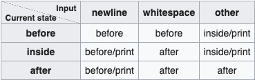
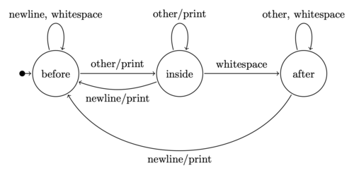

Automata-based programming
============
Automata-based programming is a programming paradigm in which the program or part of it is thought of as a model of a finite-state machine (FSM) or any other (often more complicated) formal automaton (see automata theory). Sometimes a potentially infinite set of possible states is introduced, and such a set can have a complicated structure, not just an enumeration.

Finite-state machine-based programming is generally the same, but, formally speaking, does not cover all possible variants, as FSM stands for finite-state machine, and automata-based programming does not necessarily employ FSMs in the strict sense.

The following properties are key indicators for automata-based programming:

The time period of the program's execution is clearly separated down to the automaton steps. Each step is effectively an execution of a code section (same for all the steps) which has a single entry point. That section might be divided down to subsections to be executed depending on different states, although this is not necessary.
Any communication between the automaton steps is only possible via the explicitly noted set of variables named the automaton state. Between any two steps, the program cannot have implicit components of its state, such as local variables' values, return addresses, the current instruction pointer, etc. That is, the state of the whole program, taken at any two moments of entering an automaton step, can only differ in the values of the variables being considered as the automaton state.
The whole execution of the automata-based code is a cycle of the automaton steps.

Another reason for using the notion of automata-based programming is that the programmer's style of thinking about the program in this technique is very similar to the style of thinking used to solve mathematical tasks using Turing machines, Markov algorithms, etc.

Example task
-----
Consider the task of reading a text from standard input line-by-line and writing the first word of each line to standard output. First we skip all leading whitespace characters, if any. Then we print all the characters of the first word. Finally we skip all the trailing characters until a newline character is encountered. Whenever a sequence of newline characters is encountered not at the beginning of the stream, we print only the first one and skip the remaining ones; else, we skip all. Next we restart the process at the following line. Upon encountering the end-of-file condition (regardless of the stage), we stop.

Traditional program
-----
A traditional program in C which performs the above task could look like this:
```
#include <ctype.h>
#include <stdio.h>


int main(void) {
  int c;

  do {
    do {
      c = getchar();
    } while (isspace(c));

    while (!isspace(c) && c != EOF) {
      putchar(c);
      c = getchar();
    }
    
    while (c != '\n' && c != EOF) {
      c = getchar();
    }
    
    if (c == '\n') {
      putchar(c);
    }
  } while (c != EOF);

  return 0;
}
```
For instance, compiling and running the above program on this input:
```
$ clang program.c && (printf "\t\v\f\r \n\n\t\v\f\r foo bar baz\n\n\t\v\f\r qux quux corge" | ./a.out)
```
yields:
```
foo
qux
```

Automata-based program
-----

Procedural
-----
The same task can be solved by thinking in terms of finite-state machines. Note that the parsing of a line has three stages: skipping the leading whitespace characters, printing the characters of the first word and skipping the trailing characters. Let's call these automaton states BEFORE, INSIDE and AFTER. An automata-based version of the program could look like this:
```
#include <ctype.h>
#include <stdio.h>

enum State {BEFORE, INSIDE, AFTER};

int main(void) {
  int c;
  enum State s = BEFORE;

  while ((c = getchar()) != EOF) {
    switch (s) {
      case BEFORE:
        if (!isspace(c)) {
          putchar(c);
          s = INSIDE;
        }
        
        break;
      case INSIDE:
        if (c == '\n') {
          putchar(c);
          s = BEFORE;
        } else if (isspace(c)) {
          s = AFTER;
        } else {
          putchar(c);
        }
          
        break;
      case AFTER:
        if (c == '\n') {
          putchar(c);
          s = BEFORE;
        }
        
        break;
    }
  }

  return 0;
}
```
Although the program now looks longer, it has at least one significant advantage: there is only one reading (that is, call to the getchar function) instruction. Besides that, there is only one loop instead of the four the traditional version had. The body of the while loop is the automaton step and the loop itself is the cycle of the automaton step. The program implements the work of a finite-state machine shown in the state diagram.

The most important property of the program is that the automaton step code section is clearly localized. With an explicit function step for the automation step, the program better demonstrates this property:

```
#include <stdio.h>

enum State {BEFORE, INSIDE, AFTER};

void step(enum State* const s, int const c) {
  switch (*s) {
    case BEFORE:
      if (!isspace(c)) {
        putchar(c);
        *s = INSIDE;
      }
      
      break;
    case INSIDE:
      if (c == '\n') {
        putchar(c);
        *s = BEFORE;
      } else if (isspace(c)) {
        *s = AFTER;
      } else {
        putchar(c);
      }
        
      break;
    case AFTER:
      if (c == '\n') {
        putchar(c);
        *s = BEFORE;
      }
      
      break;
  }
}


int main(void) {
  int c;
  enum State s = BEFORE;

  while ((c = getchar()) != EOF) {
    step(&s, c);
  }

  return 0;
}
```

The program now clearly demonstrates the basic properties of automata-based code:

- time periods of automaton step executions may not overlap;
- the only information passed from the previous step to the next is the explicitly specified automaton state.

A finite automaton can be defined by a state-transition table whose rows stand for the current states, columns stand for the inputs, and cells stand for the next states and actions to perform.

State-transition table
-----


State diagram
-----


Generally speaking, an automata-based program can naturally use this approach. With an explicit two-dimensional array transitions for the state-transition table, the program uses this approach:
```
#include <ctype.h>
#include <stdio.h>

enum State {BEFORE, INSIDE, AFTER};


void nop(int const c) {}


void print(int const c) {
  putchar(c);
}


struct Branch {
  enum State const next_state;
  void (*action)(int);
};


struct Branch const transitions[3][3] = {
  //   newline         whitespace         other             Inputs/States
  {{BEFORE,   &nop}, {BEFORE, &nop}, {INSIDE, &print}},  // before
  {{BEFORE, &print}, {AFTER,  &nop}, {INSIDE, &print}},  // inside
  {{BEFORE, &print}, {AFTER,  &nop}, {AFTER,    &nop}}   // after
};


void step(enum State* const s, int const c) {
  int const row = (*s == BEFORE) ? 0 : (*s == INSIDE) ? 1 : 2;
  int const column = (c == '\n') ? 0 : isspace(c) ? 1 : 2;
  struct Branch const* const b = &transitions[row][column];
  *s = b->next_state;
  b->action(c);
}


int main(void) {
  int c;
  enum State s = BEFORE;

  while ((c = getchar()) != EOF) {
    step(&s, c);
  }

  return 0;
}
```

Object-oriented
-----
If the implementation language supports object-oriented programming, a simple refactoring of the program is to encapsulate the automaton into an object, thus hiding its implementation details. The program in C++ using object-oriented style could look like this:
```
#include <stdio.h>

enum State {BEFORE, INSIDE, AFTER};


struct Branch {
  enum State const next_state;
  void (*action)(int);
};


class StateMachine {
  public:
    StateMachine();
    void feedChar(int);

  protected:
    static void nop(int);
    static void print(int);

  private:
    enum State _state;
    static struct Branch const _transitions[3][3];
};


StateMachine::StateMachine(): _state(BEFORE) {}


void StateMachine::feedChar(int const c) {
  int const row = (_state == BEFORE) ? 0 : (_state == INSIDE) ? 1 : 2;
  int const column = (c == '\n') ? 0 : isspace(c) ? 1 : 2;
  struct Branch const* const b = &_transitions[row][column];
  _state = b->next_state;
  b->action(c);
}


void StateMachine::nop(int const c) {}


void StateMachine::print(int const c) {
  putchar(c);
}


struct Branch const StateMachine::_transitions[3][3] = {
  //   newline         whitespace         other             Inputs/States
  {{BEFORE,   &nop}, {BEFORE, &nop}, {INSIDE, &print}},  // before
  {{BEFORE, &print}, {AFTER,  &nop}, {INSIDE, &print}},  // inside
  {{BEFORE, &print}, {AFTER,  &nop}, {AFTER,    &nop}}   // after
};


int main() {
  int c;
  StateMachine m;

  while ((c = getchar()) != EOF) {
    m.feedChar(c);
  }

  return 0;
}
```
Note. — To minimize changes not directly related to the subject of the article, the input/output getchar and putchar functions from the standard library of C are being used.

The state design pattern is a way for an object to change its behavior at runtime according to its internal state without resorting to large conditional statements or table lookups thanks to virtual function calls. Its main advantage over code using large conditional statements is that state-specific code is distributed across different objects rather than localized in a monolithic block, which improves maintainability. Its main advantages over code using state-transition tables are that virtual function calls are often more efficient than table lookups, that state-transition criteria are more explicit than in tabular format, and that it is easier to add actions accompanying state transitions. However it introduces a new problem: the number of classes makes the code less compact than the other approaches. The program using the state design pattern could look like this:
```
#include <stdio.h>

class StateMachine;


class State {
  public:
    virtual void feedChar(StateMachine*, int) const = 0;
};


class Before: public State {
  public:
    static State const* instantiate();
    virtual void feedChar(StateMachine*, int) const override;

  protected:
    Before() = default;

  private:
    static State const* _instance;
};


class Inside: public State {
  public:
    static State const* instantiate();
    virtual void feedChar(StateMachine*, int) const override;

  protected:
    Inside() = default;

  private:
    static State const* _instance;
};


class After: public State {
  public:
    static State const* instantiate();
    virtual void feedChar(StateMachine*, int) const override;

  protected:
    After() = default;

  private:
    static State const* _instance;
};


class StateMachine {
  public:
    StateMachine();
    void feedChar(int);

  protected:
    void setState(State const*);

  private:
    State const* _state;
    friend class Before;
    friend class Inside;
    friend class After;
};


State const* Before::instantiate() {
  if (!_instance) {
    _instance = new Before;
  }

  return _instance;
}


void Before::feedChar(StateMachine* const m, int const c) const {
  if (!isspace(c)) {
    putchar(c);
    m->setState(Inside::instantiate());
  }
}


State const* Before::_instance = nullptr;


State const* Inside::instantiate() {
  if (!_instance) {
    _instance = new Inside;
  }

  return _instance;
}


void Inside::feedChar(StateMachine* const m, int const c) const {
  if (c == '\n') {
    putchar(c);
    m->setState(Before::instantiate());
  } else if (isspace(c)) {
    m->setState(After::instantiate());
  } else {
    putchar(c);
  }
}


State const* Inside::_instance = nullptr;


State const* After::instantiate() {
  if (!_instance) {
    _instance = new After;
  }

  return _instance;
}


void After::feedChar(StateMachine* const m, int const c) const {
  if (c == '\n') {
    putchar(c);
    m->setState(Before::instantiate());
  }
}


State const* After::_instance = nullptr;


StateMachine::StateMachine(): _state(Before::instantiate()) {}


void StateMachine::feedChar(int const c) {
  _state->feedChar(this, c);
}


void StateMachine::setState(State const* const s) {
  _state = s;
}


int main() {
  int c;
  StateMachine m;

  while ((c = getchar()) != EOF) {
    m.feedChar(c);
  }

  return 0;
}
```

Automation and automata
-----
Automata-based programming indeed closely matches the programming needs found in the field of automation.

A production cycle is commonly modelled as:

- a sequence of stages stepping according to input data (from captors);
- a set of actions performed depending on the current stage.

Various dedicated programming languages allow expressing such a model in more or less sophisticated ways.

Automation program
-----
The example presented above could be expressed according to this view like in the following pseudo-code ('set' activates a logic variable, 'reset' inactivates a logic variable, ':' assigns a variable, and '=' tests for equality):
```
newline: '\n'
whitespace: ('\t', '\n', '\v', '\f', '\r', ' ')
states: (before, inside, after)


setState(c) {
  if before and (c != newline and c not in whitespace) then set inside
  if inside then (if c in whitespace then set after else if c = newline then set before)
  if after and c = newline then set before
}


doAction(c) {
  if before and (c != newline and c not in whitespace) then write(c)
  if inside and c not in whitespace then write(c)
  if after and c = newline then write(c)
}


cycle {
  set before

  loop until (c: readCharacter) = EOL {
    setState(c)
    doAction(c)
  }
}
```
The separation of routines expressing cycle progression on one side, and actual action on the other (matching input and output) allows clearer and simpler code.

Events
-----
In the field of automation, stepping from step to step depends on input data coming from the machine itself. This is represented in the program by reading characters from a text. In reality, those data inform about position, speed, temperature, etc. of critical elements of a machine.

Like in GUI programming, changes in the machine state can thus be considered as events causing the passage from a state to another, until the final one is reached. The combination of possible states can generate a wide variety of events, thus defining a more complex production cycle. As a consequence, cycles are usually far to be simple linear sequences. There are commonly parallel branches running together and alternatives selected according to different events, schematically represented below:
```
   s:stage   c:condition
   
   s1
   |
   |-c2
   |
   s2
   |
   ----------
   |        |
   |-c31    |-c32
   |        |
  s31       s32
   |        |
   |-c41    |-c42
   |        |
   ----------
   |
   s4
```

Applications
-----
Automata-based programming is widely used in lexical and syntactic analyses.

Besides that, thinking in terms of automata (that is, breaking the execution process down to automaton steps and passing information from step to step through the explicit automaton state) is necessary for event-driven programming as the only alternative to using parallel processes or threads.

The notions of states and state machines are often used in the field of formal specification. For instance, UML-based software architecture development uses state diagrams to specify the behaviour of the program. Also various communication protocols are often specified using the explicit notion of state (e.g., RFC 793).

Thinking in terms of automata (steps and states) can also be used to describe semantics of some programming languages. For example, the execution of a program written in the Refal language is described as a sequence of steps of a so-called abstract Refal machine; the state of the machine is a view (an arbitrary Refal expression without variables).

Continuations in the Scheme language require thinking in terms of steps and states, although Scheme itself is in no way automata-related (it is recursive). To make it possible for the call/cc feature to work, implementation needs to be able to catch a whole state of the executing program, which is only possible when there is no implicit part in the state. Such a caught state is the very thing called continuation, and it can be considered as the state of a (relatively complicated) automaton. The automaton step is deducing the next continuation from the previous one, and the execution process is the cycle of such steps.

Alexander Ollongren in his book explains the so-called Vienna method of programming languages semantics description which is fully based on formal automata.

The STAT system is a good example of using the automata-based approach; this system, besides other features, includes an embedded language called STATL which is purely automata-oriented.

History
-----
Automata-based techniques were used widely in the domains where there are algorithms based on automata theory, such as formal language analyses.

One of the early papers on this is by Johnson et al., 1968.

One of the earliest mentions of automata-based programming as a general technique is found in the paper by Peter Naur, 1963. The author calls the technique Turing machine approach, however no real Turing machine is given in the paper; instead, the technique based on steps and states is described.

Comparison with imperative and procedural programming
-----
The notion of state is not exclusive property of automata-based programming. Generally speaking, state (or program state) appears during execution of any computer program, as a combination of all information that can change during the execution. For instance, a state of a traditional imperative program consists of

- values of all variables and the information stored within dynamic memory;
- values stored in registers;
- stack contents (including local variables' values and return addresses);
- current value of the instruction pointer.

These can be divided to the explicit part (such as values stored in variables) and the implicit part (return addresses and the instruction pointer).

Having said this, an automata-based program can be considered as a special case of an imperative program, in which implicit part of the state is minimized. The state of the whole program taken at the two distinct moments of entering the step code section can differ in the automaton state only. This simplifies the analysis of the program.

Object-oriented programming relationship
-----
In the theory of object-oriented programming, an object is said to have an internal state and is capable of receiving messages, responding to them, sending messages to other objects and changing its internal state during message handling. In more practical terminology, to call an object's method is considered the same as to send a message to the object.

Thus, on the one hand, objects from object-oriented programming can be considered as automata (or models of automata) whose state is the combination of private fields, and one or more methods are considered to be the step. Such methods must not call each other nor themselves, neither directly nor indirectly, otherwise the object can not be considered to be implemented in an automata-based manner.

On the other hand, object is good for implementing a model of an automaton. When the automata-based approach is used within an object-oriented language, an automaton model is usually implemented by a class, the state is represented with private fields of the class, and the step is implemented as a method; such a method is usually the only non-constant public method of the class (besides constructors and destructors). Other public methods could query the state but don't change it. All the secondary methods (such as particular state handlers) are usually hidden within the private part of the class.
